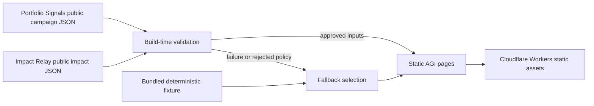

# Architecture

## System overview

AGI is a static Next.js App Router application. The designed suite stack is **Cloudflare + existing Supabase** only: this public site stays static on Cloudflare; durable data and auth stay on the existing platform Supabase project. GitHub Actions builds the site from `main`, retrieves approved public aggregate signals during that build, and exports static files to `out/`. Production uploads `out/` to Cloudflare Workers static assets, serving the `autogive.app` apex. Vercel is retained as rollback. GitHub Pages is a fallback mirror. Do not treat Render, Fly, or Railway as remaining hosts.

The deployed browser receives only static HTML, CSS, JavaScript, brand assets, and the selected public-safe projection. It does not call Portfolio Signals or Impact Relay at runtime.

## Runtime and deployment model

- **Framework:** Next.js 16 App Router with React 19 and TypeScript.
- **Output:** static export (`output: "export"`), Turbopack production build by default.
- **Designed stack:** Cloudflare (this static site and public ingress) + existing Supabase (suite auth, Postgres, RLS). This repo does not call Supabase at runtime.
- **Hosting:** **Cloudflare Workers static assets** (`agi-public`) is the production host at **https://autogive.app**. Vercel is retained as rollback; GitHub Pages remains a github.io fallback. See [CLOUDFLARE.md](CLOUDFLARE.md).
- **Build:** Node.js 22; static export to `out/` at site root (`basePath` empty).
- **Suite paths:** `/portfolio-signals/` and `/impact-relay/` are reverse-proxied by a thin Worker (`workers/suite-gateway.ts`), matching [`vercel.json`](../vercel.json). Those products are not merged into this repo.
- **State:** local React state for the replayable demonstration; no persistence on this site.
- **External data:** two fixed HTTPS sources fetched at build time with a bundled fallback. Source URLs are the org raw GitHub documents. Historical `scrimshawlife-ctrl/Fund-Intel` URLs are not fetched.
- **Security headers:** CSP, frame denial, and related headers are set on the Worker (including static assets), Vercel, and Pages `_headers`. Suite fonts are self-hosted at build time with `next/font` (no `fonts.googleapis.com` at runtime). The marketing CSP stays self-only. Proxied `/portfolio-signals/` and `/impact-relay/` responses pass through an upstream CSP when present; otherwise they use a suite CSP that allows Portfolio Signals' existing jsDelivr `supabase-js` module and the platform Supabase project. `/workspace` 301s to `/portfolio-signals/workspace.html` so relative workspace assets resolve.

`site.ts` owns the canonical production origin (`https://autogive.app`). `site-public.ts` is the official unique public HTML page list for this export (`/`, `/legal`, `/legal/privacy`, `/legal/terms`). `app/sitemap.ts` and `app/robots.ts` generate `/sitemap.xml` and `/robots.txt` on the static export so those files are served at the apex after deploy. Locs and canonicals use the apex host, not `www`, `vercel.app`, or `github.io`. `robots.txt` allows public crawlers, points `Sitemap:` at `https://autogive.app/sitemap.xml`, and disallows auth, admin, workspace, and PII-adjacent suite paths this host serves. Parked `/login` and `/admin` shells are `noindex` and canonical to the homepage. Proxied Portfolio Signals and Impact Relay landings are first-party 200s on the apex but are owned by other repos and are not listed in this export's sitemap. `next.config.ts` defaults to an empty base path so the custom domain serves assets from `/`. DNS and cutover: [CUSTOM-DOMAIN.md](CUSTOM-DOMAIN.md).

## Component boundaries

| Path                            | Responsibility                                                        |
| ------------------------------- | --------------------------------------------------------------------- |
| `app/page.tsx`                  | Composes the public narrative and requests validated public signals   |
| `site-public.ts`                | Official public HTML page list for sitemap, robots, and canonicals    |
| `app/sitemap.ts` / `app/robots.ts` | Static-export `/sitemap.xml` and `/robots.txt` at the apex          |
| `components/public-signals.tsx` | Renders the selected live or fallback aggregate projection            |
| `components/donation-demo.tsx`  | Runs the deterministic, non-payment contribution story                |
| `components/navbar.tsx`         | Provides AGI and reciprocal suite navigation                          |
| `demo/scenario.ts`              | Canonical SPEC-011 Community AI Lab demonstration state               |
| `integration/public-sources.ts` | Fetches, validates, selects, and normalizes public projections        |
| `integration/validate-public.ts` | Fail-closed schema validation for both published public documents   |
| `integration/freshness.ts`      | 24 h soft / 7 d hard freshness policy and clock assumptions           |
| `integration/diagnostics.ts`    | Privacy-safe build-log summary (source, age, state, reason)           |
| `integration/signal-copy.ts`    | Accessible provenance and freshness copy                              |
| `integration/contracts.ts`      | Defines versioned narrative contracts, field owners, and versioning |
| `integration/glossary.ts`       | Shared allocationId and status vocabulary for matching fixtures |
| `integration/validate-contracts.ts` | Fail-closed validation for narrative contract fixtures |
| `integration/fixtures.ts`       | Supplies public-safe deterministic contract fixtures                  |
| `workers/suite-gateway.ts`   | Reverse-proxies suite paths on Cloudflare (same role as `vercel.json`) |

The page component is the server entry point. Interactive state stays in focused client components rather than moving the whole page to the client.

## Trust boundaries

Portfolio Signals and Impact Relay documents are external, untrusted input even though they come from repositories in the same suite. The adapter must:

1. require successful HTTP responses;
2. require Portfolio Signals authority `advisory_only`;
3. require Impact Relay authority `public_aggregate_only`;
4. select only an outcome whose evidence state is `VERIFIED`;
5. return the deterministic fixture on any fetch, parse, policy, evidence, or hard-freshness failure.

The site never requests donor identity, contact details, payment records, raw receipts, private documents, or secret evidence URLs. `verified` means the source published an approved aggregate verification state; it does not establish one-to-one attribution to a donor.

## Failure behavior

The application is designed to remain honest and available when external data is not:

- unavailable source or thrown fetch → `fallback` (deterministic fixture);
- non-2xx response → `fallback`;
- malformed JSON or published-schema mismatch → `malformed`;
- unexpected authority, privacy constants not fail-closed, or no `VERIFIED` outcome → `policy_rejected`;
- older than 24 hours and within 7 days → `stale` (remote data, labeled delayed);
- older than 7 days, or unassessable timestamp → `fallback` (`hard_stale`).

The UI labels each explicit state and never surfaces raw payloads. Delayed records are not treated as current evidence. See [INTEGRATION_CONTRACTS.md](INTEGRATION_CONTRACTS.md).

## Deliberate exclusions

The current architecture has no backend, authentication, database, payment processing, CMS, donor account, runtime write operation, or notification delivery **on this public site**. Durable suite data and auth stay on **existing Supabase**. The Cloudflare Worker is suite-path reverse proxy only (the same role as Vercel rewrites), not an AGI API. Do not add OpenNext SSR, a Node server, D1/KV, a second database, or Render / Fly / Railway. Adding any of those to this site changes the threat model and requires a separately reviewed architecture plan.
